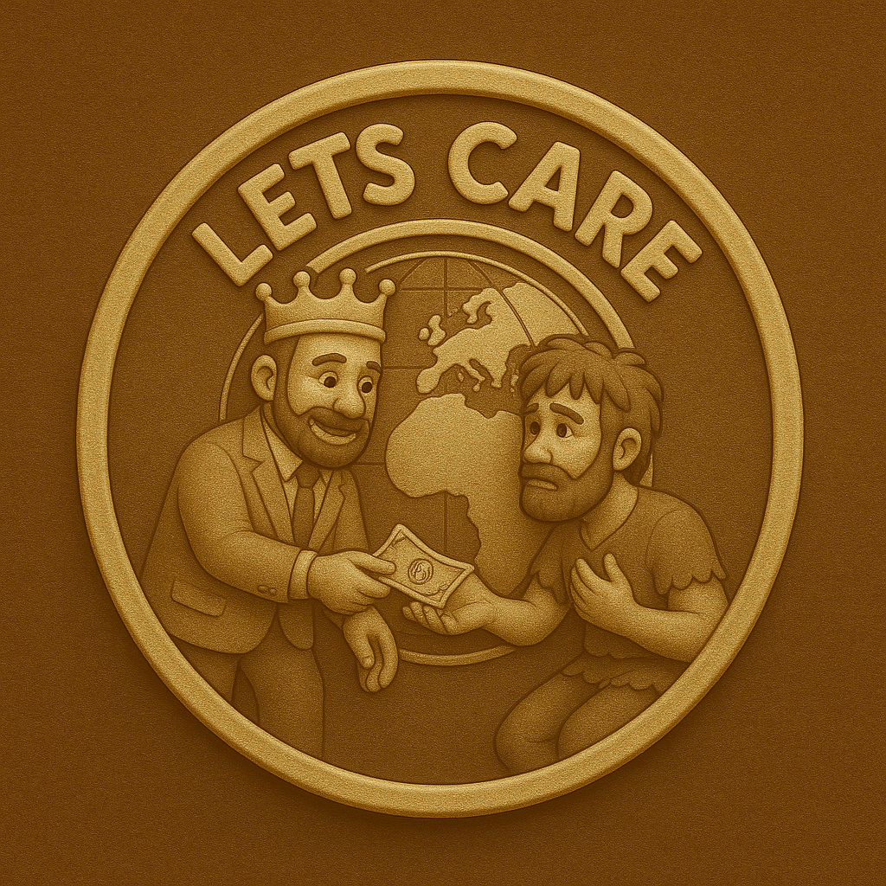

  

💚 $GIVE – Born from the Spirit of Compassion

$GIVE is not just a cryptocurrency. It was born from real stories. From seeing people around us struggle silently. From witnessing communities that are full of potential, but forgotten. From feeling the urge to do something — even if it's small.

This token was inspired by the people around us who are often overlooked.  
People who simply need a helping hand, a bit of hope, or a moment of kindness to keep going.

## ✨ Why $GIVE?

Because Web3 shouldn't only be about making money. It should also be about making meaning.

$GIVE is here to:
- Bring attention to communities that deserve better
- Encourage acts of giving — no matter how small
- Use the power of crypto to fuel real human kindness

## 🌍 Our Mission

We believe that kindness is contagious. That one generous act can inspire thousands. And that technology, when used with purpose, can heal instead of harm.

## 🔗 A Movement You Can Join

We’re not building hype. We’re building heart.  
If you believe Web3 should be more human, more hopeful — then $GIVE is for you.

**Let’s spread giving. Let’s turn compassion into a currency.**

## 🔗 Important Links

- 🌐 Website: [https://givecoin.vercel.app](https://givecoin.vercel.app)
- 💬 Telegram: [https://t.me/GIVEcoin07(https://t.me/GIVEcoin07)
- 🐦 Twitter: [https://twitter.com/$GIVEcoin](https://twitter.com/$GIVEcoin)

## 📊 Tokenomics

Total Supply: 1,000,000,000 $GIVE

- 🔁 50% — Liquidity (fair launch di pump.fun)
- 🎁 20% — Airdrop & Community Rewards
- 💚 15% — Charity & Social Impact
- 🧠 10% — Development & Future Features
- 🔒 5%  — Team (locked & vested)

> ✅ No Presale • ✅ No Dev Dump • ✅ 100% Transparency
>
>## 🛣️ Roadmap

### ✅ Phase 1 – Foundation
- Launch token on Pump.fun
- Build community on Telegram & Twitter
- Launch first version of website
- Publish Tokenomics & whitepaper

### 🚧 Phase 2 – Awareness
- Start airdrop campaign
- Partner with micro-influencers & Web3 creators
- Launch “1 Good Act A Day” social challenge
- Begin charity micro-giving pilot

### 🔜 Phase 3 – Utility & Growth
- Develop $GIVE donation platform (Web3)
- Integrate $GIVE tipping/bot system (Telegram & X)
- List on community DEX tools (Birdeye, Dexscreener)
- Launch merch drop to fund causes

### 🔮 Phase 4 – Vision Expansion
- DAO for community voting on donations
- Expand global giving campaigns
- $GIVE becomes symbol of empathy on-chain 
- 
